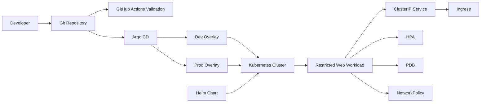

# Architecture

This template models a small stateless HTTP application and the platform controls commonly expected around it.

## Deployment Model

- `k8s/base` contains reusable Kubernetes objects.
- `k8s/overlays/dev` lowers cost and uses a development hostname.
- `k8s/overlays/prod` increases availability, resource ceilings, and autoscaling.
- `charts/app` provides a Helm packaging option for teams that prefer release-oriented deployments.
- `gitops/argocd` shows how overlays can be reconciled by Argo CD.

## Runtime Controls

The workload is designed for restricted environments:

- Runs as UID/GID `101`.
- Uses `runAsNonRoot: true`.
- Drops all Linux capabilities.
- Disables privilege escalation.
- Uses a read-only root filesystem.
- Mounts only the runtime paths nginx needs as `emptyDir`.
- Disables service account token automounting.

## Availability Controls

- Rolling update with `maxUnavailable: 0`.
- `readinessProbe` to remove unavailable pods from service endpoints.
- `livenessProbe` to restart unhealthy containers.
- `startupProbe` to protect slow starts from early liveness failures.
- `HorizontalPodAutoscaler` for CPU and memory driven scaling.
- `PodDisruptionBudget` to reduce voluntary disruption impact.
- Soft topology spread constraints across zones.

## Network Controls

The base manifests use default-deny NetworkPolicy for selected app pods and then add allow policies for:

- HTTP traffic from the ingress controller namespace.
- Same-namespace traffic for controlled internal access.
- DNS egress to CoreDNS.
- HTTPS egress to public addresses.

NetworkPolicy behavior depends on a CNI plugin that enforces the API.
